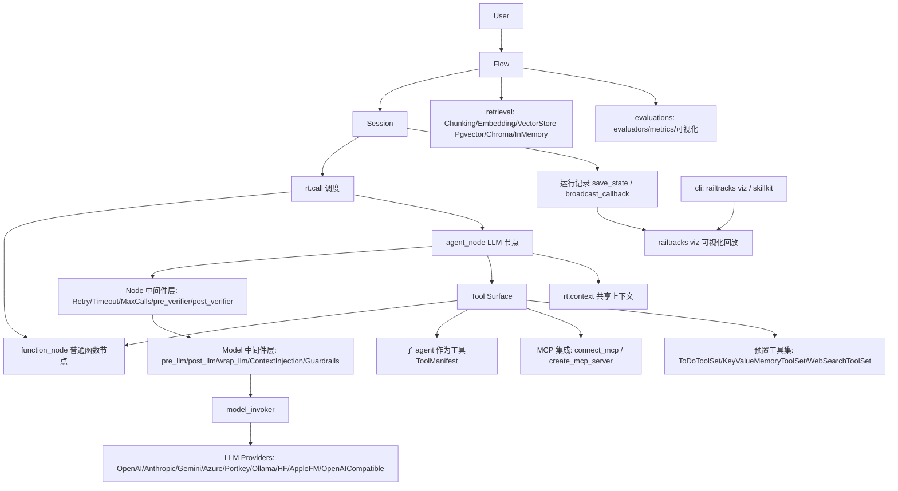

# 架构

结论：Railtracks 是「纯 Python 组装式 agent 框架」：以 Node（function/agent 两类）为基本单元，`Flow` 驱动一次运行，中间件（node 级 + model 级）织入控制逻辑，LLM Provider 层统一多家模型，外围提供 MCP 集成、检索（retrieval）、评估（evaluations）与本地可视化。

## 组件职责

- **Node（`built_nodes/`）**：一切的基本单元。`function_node` 把普通函数（含 docstring 自动生成工具 schema）变成工具节点；`agent_node` 运行工具调用循环，支持 `output_schema`（pydantic 结构化输出）、`system_message`、`tool_nodes`（`built_nodes/function/node.py`、`built_nodes/llm/node.py`，路径信源）。
- **NodeBuilder（`built_nodes/_node_builder.py`）**：`rt.agent_node` / `rt.function_node` 背后的工厂，暴露 `model`、`system_message`、`schema`、`connected_nodes`、`middleware`、`model_middleware` 等槽位。
- **Flow / Session（`_session.py`）**：`rt.Flow(name, entry_point, timeout, context, save_state, end_on_error)` 是运行入口；`.connect()` 得到可并发、可事后读取 context 与 message_histories 的 `FlowConnection`；`rt.call` 在节点间调用，支持 asyncio.gather 并行（docs/scripts/session.py、flows_sessions.py）。
- **中间件体系（`built_nodes/llm/middleware/`）**：两层——node 级（`middleware=`，wrap_node/pre/post_node，每次节点调用执行）与 model 级（`model_middleware=`，pre_llm/post_llm/wrap_llm，每次模型调用执行）；`rt.couple` 可事后附加并形成洋葱序。预置件在 `railtracks.prebuilt.middleware`：MaxCalls（必须放 model_middleware 槽，issue #1560）、Timeout、Retry、Lock、pre_verifier/post_verifier（人审/HIL）、ContextInjection、PII 脱敏 guardrails（examples/harness/README.md、docs/scripts/middleware.py、verifiers.py）。
- **LLM Provider 层**：`rt.llm.*` 统一接口覆盖 OpenAI、Anthropic、Gemini、Azure（AI Foundry）、Portkey、Ollama、HuggingFace、AppleFM（macOS 26+，extra `apple`）、OpenAICompatible；异常细分为 Timeout/RateLimit/Auth 等 LLMError 族（docs/scripts/providers.py、error_handling.py）。
- **工具面**：函数即工具、agent 即工具（`ToolManifest`）、MCP（`connect_mcp` 支持 HTTP/Stdio，`create_mcp_server` 反向把 RT 节点导出为 MCP server）、预置工具集（ToDo、KeyValueMemory、WebSearch，均带 `.prompt()` 与回调/后端可换）。
- **上下文（`rt.context`）**：Flow 级注入的 key-value 共享空间，get/put，配合 ContextInjection 做 prompt 占位符替换。
- **检索子系统（`railtracks.retrieval`）**：Chunking / Embedding（OpenAIEmbedding）/ VectorStore 后端（InMemory 可 snapshot、Pgvector、Chroma、ChromaCloud，距离度量可配），带 label scope 与 metadata filter；另有 KeyValueStore 支撑记忆工具集（docs/scripts/retrieval/store.py、key_value_memory.py）。
- **评估子系统（`rt.evaluations`）**：judge / llm_inference / tool_use 等 evaluator + 数值/分类 metric + 可视化（docs/evaluations/）。
- **观测与回放**：`save_state=True` 落盘 `.railtracks/<name>.json`，`broadcast_callback` 实时事件外推，`railtracks viz` 本地回放完整请求图；日志经 `rt.enable_logging` 可接 railtownai/Loggly/Sentry。
- **CLI（`cli/`）**：`railtracks` 命令行（viz 等），内嵌 `_skillkit` 可向 Claude/Codex/Copilot/Cursor 安装技能（cli/_skillkit/providers/*）。
- **Harness 示例（`examples/harness/`）**：官方推荐的五种部件（Loop/Tool surface/Context/Controls/Record）组装范式：minimal（只读）与 coding（写文件/shell 均需人审，且明确 run_shell 非沙箱）。