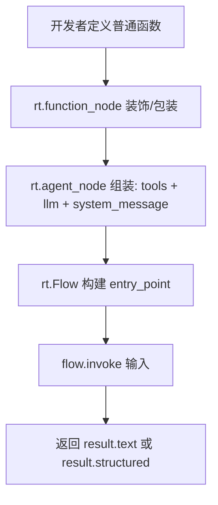
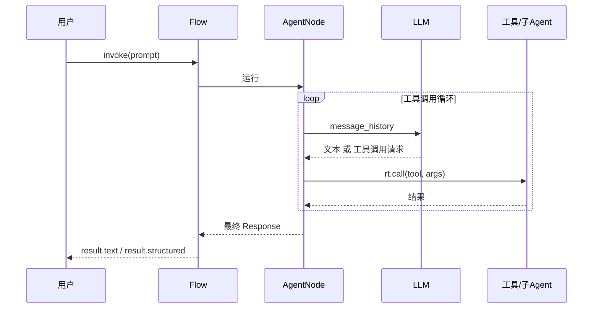
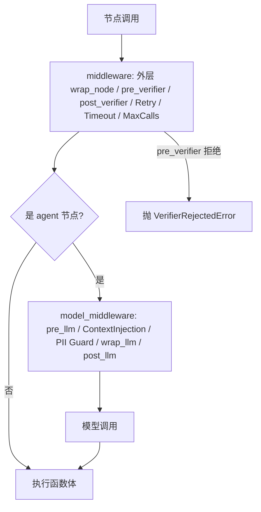
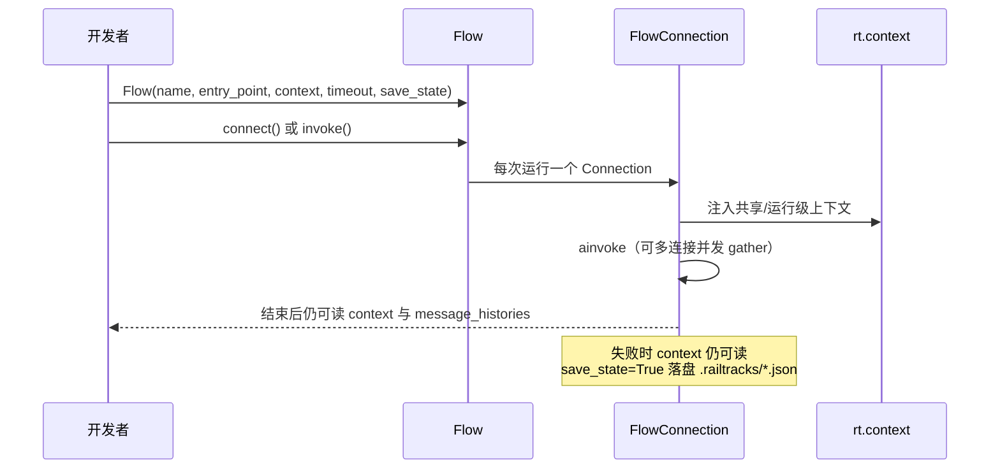
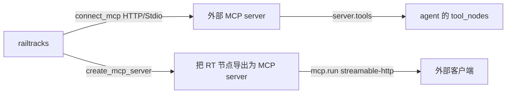

# 核心业务流程

## 1. 构建并调用第一个 Agent

主路径：函数 → 工具节点 → agent → Flow.invoke。

docstring 即工具描述；`output_schema`（pydantic）时返回 `result.structured`（README.md、docs/scripts/first_agent.py）。

## 2. Agent 工具调用循环（多步协作）

agent 内部循环调用模型，模型可发起工具调用，工具间用 `rt.call` 组合（可为子 agent），同步/异步统一。

顺序、分支、循环直接用 Python 控制流表达；并行用 `asyncio.gather(*rt.call(...))`（docs/scripts/flows.py、async_await.py）。

## 3. 中间件与控制（Controls）

两层中间件在调用链上洋葱式包裹；verifier 是人审/HIL 的统一形态。

`MaxCalls` 必须放 `model_middleware` 槽位才生效（issue #1560，examples/harness/README.md）；`post_verifier` 可改写结果（如脱敏），`couple()` 后加的中间件位于最外层（docs/scripts/middleware.py ordering 示例）。

## 4. Flow / Connection 生命周期与上下文

`.update_context()` 派生不同上下文的运行；`end_on_error` 控制异常语义（docs/scripts/flows_sessions.py、session.py）。

## 5. MCP 双向集成

多 server 工具可拼接为 `all_tools` 供一个 agent 使用（docs/scripts/MCP_tools_in_RT.py、RTtoMCP.py）。

## 6. 检索（RAG）管道

ingestion（chunk + embed + 写入）→ query（embed + scope + top_k + 过滤）→ 结果带 rank/score；后端可换 InMemory（可 snapshot）/Pgvector/Chroma/ChromaCloud，语义或词法搜索可插拔到记忆工具集（docs/retrieval/、docs/scripts/retrieval/store.py、key_value_memory.py）。

## 非核心流程（文字带过）

- **评估**：`rt.evaluations.evaluate` 用 judge/llm_inference/tool_use evaluator + metric 打分并可视化（docs/evaluations/）。
- **错误处理**：LLMError 族细分（Timeout/RateLimit/Auth），推荐指数退避重试可瞬时错误、跨 provider fallback、`err.format_verbose()` 带完整 message_history（docs/scripts/error_handling.py）。
- **观测**：`enable_logging` + broadcast_callback + `railtracks viz` 回放。
- **CLI skillkit**：向 Claude/Codex/Copilot/Cursor 安装代码风格技能。