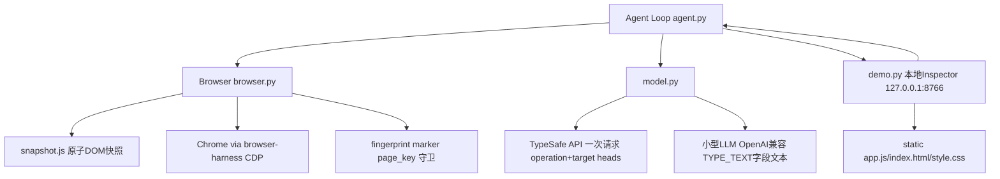

# 架构 · jev-ultrafast

核心设计：**观测（snapshot.js 原子 DOM 读）→ 决策（TypeSafe 一次请求多 head）→ 执行（browser.py 守卫 + CDP 输入）→ 再观测**，循环体在 agent.py（约 200 行），文本生成独立走小型 OpenAI 兼容模型。

## 组件职责

- **agent.py（Agent）**：完整循环。`tick = predict + act`；决策一次性消费防止重试双击；`DONE`/`BLOCKED` 终止；执行日志先于再观测写入，陈旧观测不抹除已执行动作；MAX_STEPS=60 上限、连续 3 次无变化且非 WAIT 则 blocked（信源：agent.py、questions.py）。
- **browser.py（Browser + browser_operation）**：经 browser-harness 单 CDP 会话驱动 Chrome；后台标签页焦点仿真防节流；执行前 freshness/hit-test/可见性/禁用态守卫；`after_input` 等待（combobox 建议 ≤200ms，其他 ≤2 帧/50ms）；fingerprint 基于语义而非截图。
- **snapshot.js**：一次 `Runtime.evaluate` 原子读出可见控件（role/label/value/checked/几何）、可见文本（≤6000 字符）、节点身份 WeakMap、page_key 与 per-node guards；输出动作上限 250 条 + scroll/wait 控制项。
- **model.py**：构造一次 TypeSafe 请求（operation head + 各操作投机 target head，各自只含兼容元素）；严格校验响应（choice 必须是概率最大项、概率和≈1、有限非负）；`field_text` 生成并严格解析字段文本；429/503/529 指数退避重试。
- **questions.py**：模型指令常量（NEXT_ACTION / TARGET / TEXT_VALUE），页面文本标记为不可信数据。
- **demo.py + static/**：仅绑定 127.0.0.1 的 inspector，Token + Origin/Host 校验，显示元素编号、操作/目标概率与历史轨迹，支持单步与自动模式。
- **examples/ + scripts/**：flights.py（独立验证结果的实测示例）、run.py（任意 URL/目标）、smoke.py（fixture 实弹冒烟）、check_guards.py（无模型调用的本地守卫回归）、record/measure/render（录制、测量、1× 渲染 demo 视频）。
- **tests/test_agent.py**：离线契约测试，覆盖响应校验、一次请求多 head、投机文本复用、陈旧页处理、指纹语义、航班独立验证等。