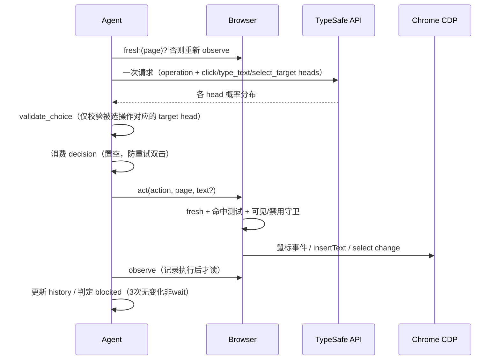
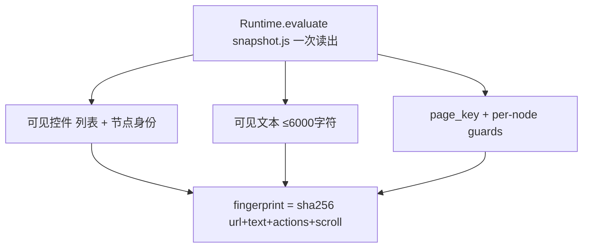
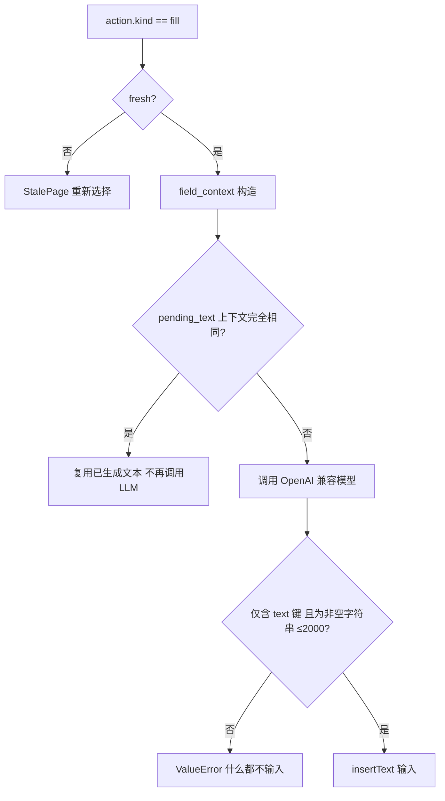
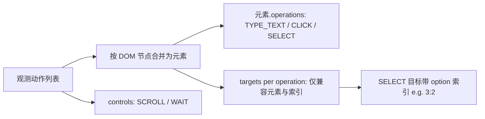
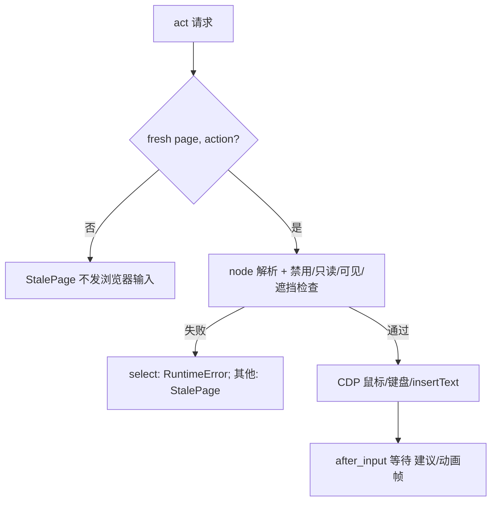

# 核心业务流程 · jev-ultrafast

## 1. 决策循环（predict → act）

说明：DONE 仍需调用方独立验证结果（examples/flights.py verify），模型答案本身不作数（agent.py、README.md）。

## 2. 原子 DOM 快照与指纹

说明：指纹比较语义与节点身份，几何不参与——动画不触发重新预测，输入前实时解析几何并 hit-test（snapshot.js、browser.py fingerprint、check_guards.py）。

## 3. TYPE_TEXT 文本生成与复用

说明：陈旧页重试仅在文本助手完整输入不变时复用生成值；无 `TEXT_MODEL_API_KEY` 时直接报错、绝不猜测（agent.py、model.py、tests）。

## 4. 目标空间构造（一次一索引，按操作分头）

说明：一个节点可同时提供 fill 与 click 两个动作（`Open <label>`），但只占一个索引；未选中的投机 head 结果不会被执行（model.py action_space / choose）。

## 5. 执行前守卫与陈旧页处理

说明：下拉选择若被导航中断（Execution context destroyed）不可作为陈旧页重试，必须人工检查（browser.py、tests/test_agent.py）。

## 非核心流程（文字带过）

- **demo inspector**：本地 HTTP 服务 + Token 鉴权，`reset/predict/act/tick` 命令转发到 Agent，串行锁防并发步骤。
- **录制/测量/渲染**：record_flights.py 连续 CDP screencast 保留原始时间戳；measure_flights.py 包装 cdp 统计调用数与耗时；render_demo.py 用 ffmpeg 输出 1× mp4/gif 并裁掉 Google 账号条。
- **check_guards.py**：本地 data: URL 页面无模型调用地回归全部执行守卫。