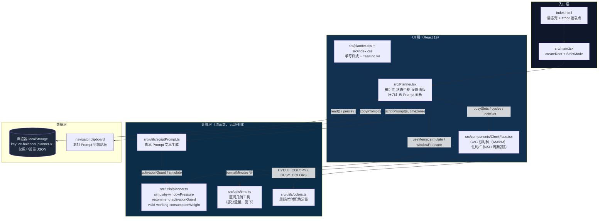

# 架构

**结论：单页纯前端三层结构——React UI 层负责交互与渲染，纯函数计算层承载全部业务逻辑（可独立测试），浏览器 localStorage 充当数据层。没有后端，没有网络调用。** 所有箭头都发生在用户浏览器进程内。

## 导读

- **入口层**：`index.html` 只有一个 `
` 与模块脚本（index.html:12-13）；`src/main.tsx:7-11` 用 `createRoot` 挂载唯一页面组件 `Planner`。
- **UI 层**：`src/Planner.tsx` 是整个应用的状态中枢——唯一的 `useState<Settings>`（src/Planner.tsx:14）持有全部设置，`update()`（src/Planner.tsx:35-41）统一做校验与合并。它把状态派生为两组东西：给 `ClockFace` 的区间数据（src/Planner.tsx:42-44），以及经 `useMemo` 缓存的模拟结果（src/Planner.tsx:30-31）。`ClockFace` 是无业务状态的展示组件（拖拽创建忙时的代码存在但 prop 未接线，见下）。
- **计算层**：业务逻辑与 React 完全解耦，集中在 `src/utils/planner.ts` 的 8 个纯函数里，这也是 `tests/planner.test.mjs` 唯一的测试对象。`src/utils/scriptPrompt.ts` 消费同一套计算结果生成给外部 AI 的 Prompt 文本。
- **数据层**：localStorage 读写全在 `Planner.tsx` 的 `read()`/`persist()`（src/Planner.tsx:9,25）；剪贴板是唯一出口（src/Planner.tsx:20-23）。
- **构建/部署**（图上未画）：Vite 7 + Tailwind v4 插件构建静态产物（base `/CC-Balancer/`），GitHub Actions 推 main 后自动发布 GitHub Pages（.github/workflows/deploy-pages.yml:3-7）。

## 已知遗留代码（建档时核实）

- `src/utils/time.ts` 中 `generateCycles`、`generateCustomCycles`、`isCycleOverlapping`、`calculateCycleDetails`、`calculateDeadZone`、`calculateMetrics` **在 src/ 与 tests/ 中均无调用方**（grep 全仓验证，2026-09-24）；ClockFace 实际只用 `formatMinutes`（及拖拽分支内的 `genId`/`isOverlapping`）。
- `ClockFace` 的拖拽创建忙时交互依赖 `onBusySlotsChange` prop（src/components/ClockFace.tsx:19,134-187），但 `Planner.tsx:58` 调用时未传入——该功能当前处于禁用状态。二者与 HEAD 提交「重构额度规划器」相符：重构前的交互式模型残留在工具文件中。
