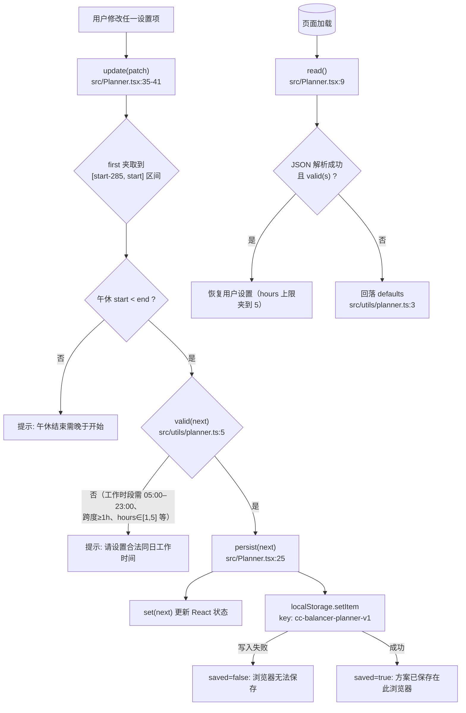
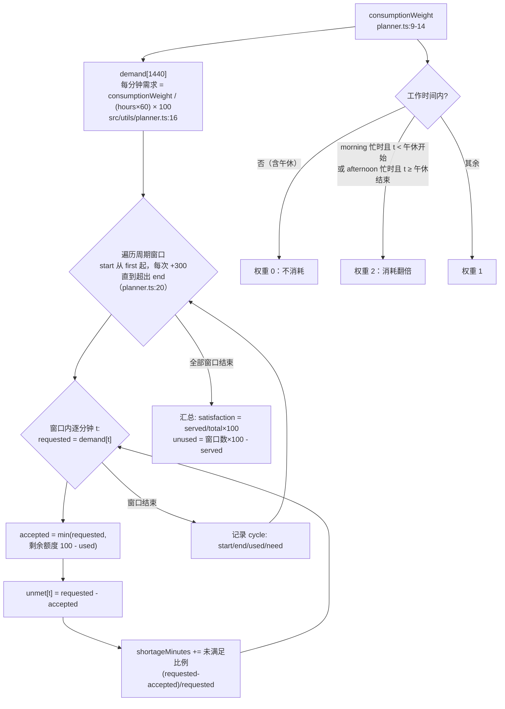
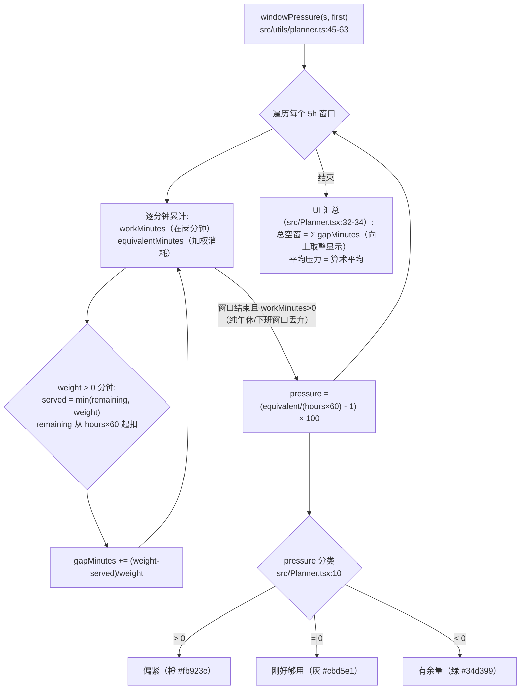
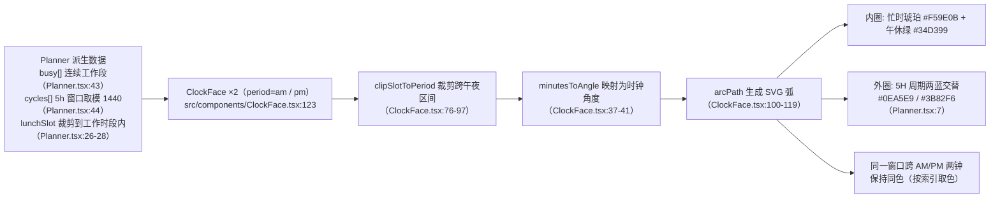
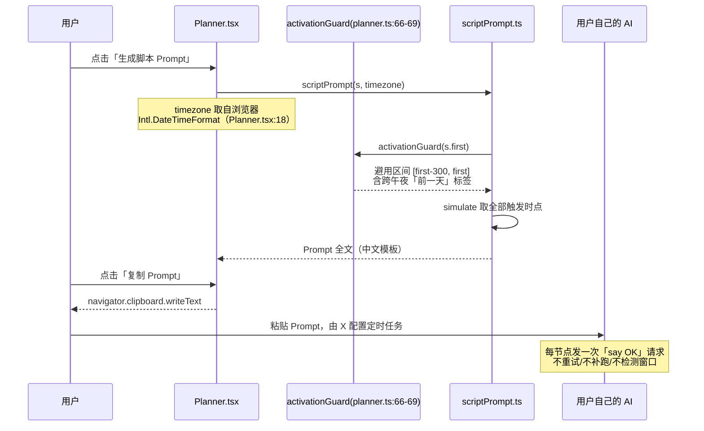

# 核心业务逻辑

**一句话：用户描述自己的工作日与额度消耗习惯，应用逐分钟模拟「每 5 小时一份、每份 100 单位」的额度供给，输出各窗口压力与空窗分钟数，并据此生成一份让外部 AI 配置定时触发脚本的 Prompt。** 以下 5 条流程覆盖全部在用逻辑；代码位置均指 `gitwire-sources/czm233-CC-Balancer/`。

## 1. 设置读取、校验与持久化

所有状态只有这一个 `Settings` 对象（8 个字段：start/end/lunch/lunchStart/lunchEnd/hours/profile/first，src/utils/planner.ts:2），任何 UI 操作最终都汇入 `update()` 单点校验。首次触发时间 `first` 被约束在工作开始前 285 分钟内（= 5h 窗口 300 分钟减去 15 分钟安全余量，src/Planner.tsx:37、planner.ts:5）。

## 2. 逐分钟额度模拟（核心算法 simulate）

关键约定（README.md:26-33 同步声明）：
- **忙时翻倍**：选「上午更忙」则上午每工作 1 分钟烧 2 分钟常规额度（planner.ts:13）；无午休时以 12:00 分界上午/下午（planner.ts:11-12）。
- **每窗 100 单位硬上限**：一个 5h 窗口最多供给 100 单位（planner.ts:24），`hours` 越小需求密度越高。
- **空窗按比例累加**：shortageMinutes 不是简单分钟差，而是逐分钟 `未满足量/需求量` 的累加（planner.ts:27）。
- 窗口序列固定从 `first` 起步长 300 分钟，**不做任何窗口检测或动态调整**——模拟假设「首次有效调用开启窗口」。

## 3. 窗口压力与空窗指标（windowPressure）

注意 `pressure` 是相对量：`(窗口加权需求/一份额度 - 1)×100`，+100% 表示该窗口需求是可支撑时长的两倍（tests/planner.test.mjs:44 有 +400% 用例）。`recommend()`（planner.ts:34-41，15 分钟步长穷举最优 first）当前**仅被测试调用，UI 未接入**。

## 4. 双时钟可视化（ClockFace）

纯展示组件：AM 钟映射 0–720 分钟、PM 钟映射 720–1440 分钟到 0–360°。组件内保留的拖拽创建忙时代码（onBusySlotsChange）因 prop 未接线而处于禁用状态（详见 architecture.md「已知遗留代码」）。

## 5. 脚本 Prompt 生成与保守避用区间

Prompt 固定包含：计划时区（要求对方确认）、全部触发时点、执行日期询问项、三条「先向我确认」（定时工具、API 地址/认证、时区）、以及严格的行为边界——不重试、不补跑、不监控窗口状态（src/utils/scriptPrompt.ts:7-33）。**保守避用区间** `activationGuard` 取首次触发前完整 5 小时（planner.ts:67），用于提示用户暂停使用以免既有窗口挤占新窗口开启（测试 tests/planner.test.mjs:59-64 验证跨午夜标签）。

## 非核心逻辑（文字概述）

- **recommend()（planner.ts:34-41）**：从 `start` 向前以 15 分钟步长穷举到 `start-285`，取 served 最大（平手取窗口数更少）的 first。当前无 UI 调用方，仅被 tests/planner.test.mjs:9-14 断言其最优性，属预留能力。
- **time.ts 遗留几何工具**：generateCycles/calculateDeadZone/calculateMetrics 等描述「周期×忙时」旧模型，重构后无调用方（grep 全仓核实），详见 architecture.md。
- **部署**：main 分支 push 触发 GitHub Actions（pnpm 10 / Node 22）构建并发布 GitHub Pages，无测试门禁（.github/workflows/deploy-pages.yml）。
- **无夜班/跨日/多账号**：README.md:30 明确当前只面向同日白天工作场景。
