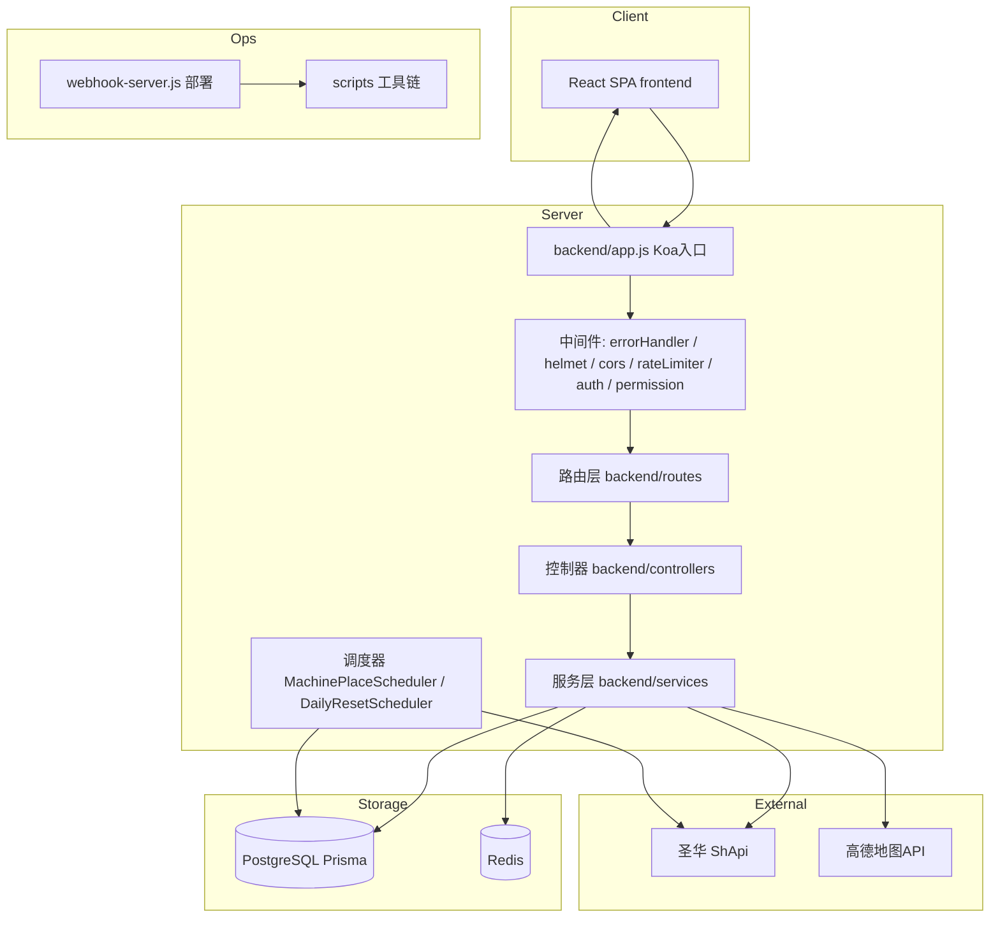

# 架构

## 组件职责

- **backend/app.js**：应用入口。装配中间件链（错误处理 → helmet/CSP → CORS → bodyParser(10mb) → 静态资源 → 限流 → 请求日志 → 业务路由 → 前端静态托管 + SPA 回退 → 404）。启动前检查 DB/Redis 连接，按环境变量启停两个定时任务，处理优雅关闭与未捕获异常。
- **路由层（backend/routes）**：12 个业务路由模块（users/songs/players/rankings/search/machines/auth-shapi/scores/resources/resourceSync/statistics/places），统一前缀 `/api/*`。search/songs/players 直接内联调用 ShapiClient（无控制器层）；users/machines/places/rankings 走控制器。
- **认证（routes/auth-shapi.js + CaptchaService）**：对接圣华登录体系（含验证码，scripts/ocr 依赖 ddddocr 疑似识别），登录后本地建用户并存 dancebattle_token（2-3 天过期，信源 scripts/README.md）。
- **中间件**：`auth.js` JWT 验证（Cookie 优先，Bearer 兜底），用户信息 Redis 缓存 24h；`permission.js` RBAC（`resource:action` + 通配符）；`rateLimiter.js` API 限流；`errorHandler.js` 统一错误。
- **服务层**：`ShapiClient`（23KB，圣华 API 封装核心）；`DanceBattleService`（36KB，成绩/玩家数据最大服务）；`MachinePlaceService`（机台同步 + 去重 + 地理编码）；`ResourceSyncService`（头像框/称号同步）；`UserService`、`RankingsService`、`StatisticsService` 等基于 BaseService/BaseResourceService 抽象。
- **数据层**：Prisma + PostgreSQL。核心表：users（含圣华 token）、machine_places（唯一约束 place_name+province+city）、avatar_frames/titles、resource_scan_results、机台在线日志。迁移见 prisma/migrations。
- **调度器**：MachinePlaceScheduler（默认 03:00 每日同步机台，MACHINE_SYNC_ENABLED 控制）；DailyResetScheduler（默认 00:05 每日重置）。
- **部署链**：GitHub push → webhook-server.js（内存锁防并发）→ deploy.sh 构建（React build 1-2GB 内存，配 4GB swap + PM2 内存上限兜底）。