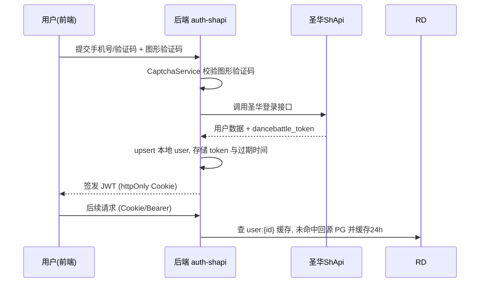
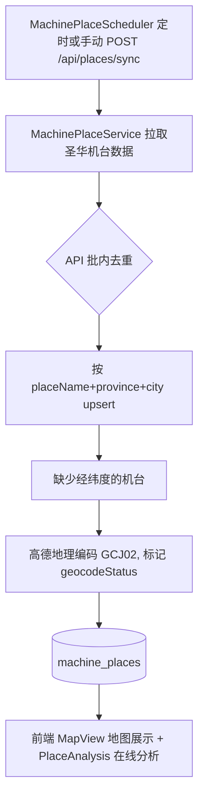
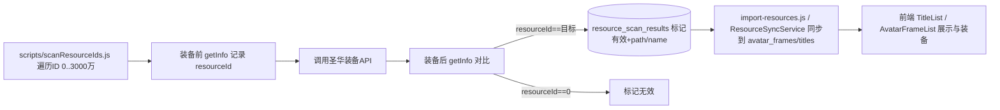
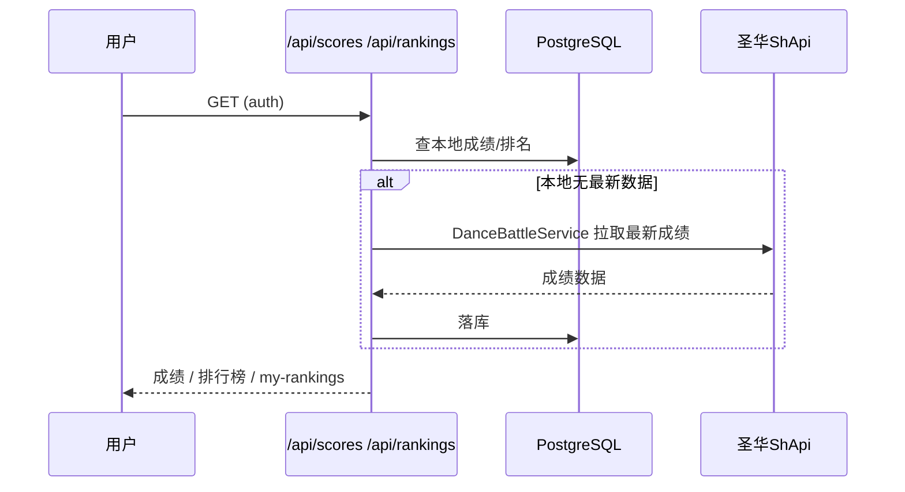

# 核心业务流程

## 1. 用户认证（圣华账号代理登录）

用户不直接注册，而是通过圣华系统登录（含验证码），后端换取 dancebattle_token 落库并签发自有 JWT。

信源：backend/routes/auth-shapi.js、backend/middleware/auth.js、frontend/src/pages/Login/。Token 有效期约 2-3 天（信源 scripts/README.md）。

## 2. 机台数据同步与地图展示

定时从圣华 API 拉取机台列表，去重 + 地理编码后入库，供前端高德地图展示与排队分析。

信源：backend/services/MachinePlaceService.js、backend/schedulers/MachinePlaceScheduler.js、scripts/backfillGeocode.js、scripts/add-unique-constraint.sql。历史上曾因去重缺失产生 228 条重复（信源 scripts/README.md）。

## 3. 资源（头像框/称号）扫描与管理

由于圣华装备 API 恒返回 200，采用“装备前后 getInfo 对比 resourceId”判定 ID 有效性，扫描结果入库，再同步到正式资源表供用户装备。

信源：scripts/README.md、scripts/scanResourceIds.js、backend/services/ResourceSyncService.js、backend/controllers/AvatarFrameController.js、TitleController.js。

## 4. 成绩与排行榜

登录用户经 JWT 认证后查询成绩（优先本地库，回源圣华）与多维排行榜（分数/连击/Perfect/游玩时长等）。

信源：backend/routes/scores.js、rankings.js、backend/services/DanceBattleService.js、RankingsService.js、UserRankService.js。

## 5. 数据统计

StatisticsService 聚合本地成绩数据生成成就、分数趋势、歌曲分析、时段分析、深度对比等视图（前端 Statistics/ 下 8 个页面）。属读多写少的聚合查询，流程不展开（信源：backend/services/StatisticsService.js、frontend/src/pages/Statistics/）。

## 非核心流程（文字带过）

- **机台排队（machines）**：用户 CRUD 机台排队信息，供其他玩家参考（backend/routes/machines.js）。
- **每日重置**：DailyResetScheduler 定时执行（默认 00:05），具体重置项未核实。
- **用户管理 RBAC**：管理员对用户的增删改、启用/禁用、密码重置（backend/routes/users.js）。