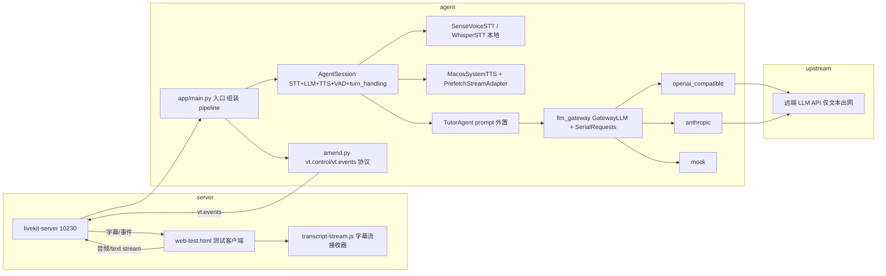

# 架构

## 组件职责

- **server/livekit-server + web-test.html**：本地回环 RTC 服务（10230–10232）与临时网页验证客户端（10233 伺服），支持自由对话/PTT、字幕、打断、语速、麦克风选择、LLM 渠道即时切换；Swift 壳就绪后废弃（server/web-test.html）。
- **transcript-stream.js**：字幕段定序器——首个有效文字固定位置、原地更新；空流/纯标点不占位；迟到的 interim 不能覆盖 final；断连后旧流不写入新通话（server/tests/transcript-stream.test.cjs 覆盖）。
- **app/main.py**：入口，组装 AgentSession（VAD min_silence 0.4s、endpointing、本地 VAD 打断检测禁 adaptive 防出网、preemptive_generation 关闭）、注册 vt.control 处理器与管线阶段事件 emit。
- **app/amend.py**：改错重发协议（v1 envelope，vt.control/vt.events），定位上一条 user 消息→截断→替换→重答；extra_dispatch 扩展 llm_switch/tts_rate/ptt 等。
- **app/llm_gateway/**：LLM 抽象层。ProviderSettings（pydantic，key 只存 env 名）；serial.py 实现同一通话最多 1 个上游请求：打断只脱离读者不取消推理、429 按 retry-after 最多重试 2 次、传输类失败 fail-closed 暂停后续请求。
- **app/plugins/**：SenseVoiceSTT（默认）/WhisperSTT（MLX，interim 字幕，begin_hold/end_hold 支持 PTT）；MacosSystemTTS 中英分段选音色、say 直出 WAV、_SYNTH_LOCK 串行；PrefetchStreamAdapter 按句串行合成。
- **app/tutor_agent.py**：Agent 定义，prompt 外置 prompts/english_tutor.md；文字回合走 `_claim_user_turn` + interrupt + generate_reply，与语音同语义。
- **scripts/**：bootstrap（初始化）、dev（复用健康服务）、acceptance.py（up/status/down，PID+进程身份+cwd 校验，拒绝管理他人进程）、issue_token.py（token/llm.json 落静态文件）、e2e_bot.py（无浏览器端到端）、bench_stt.py（SenseVoice vs Paraformer 基准）。