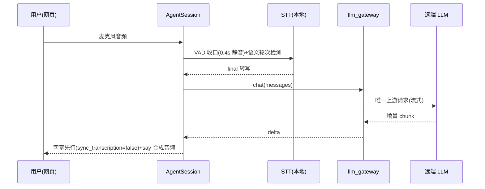
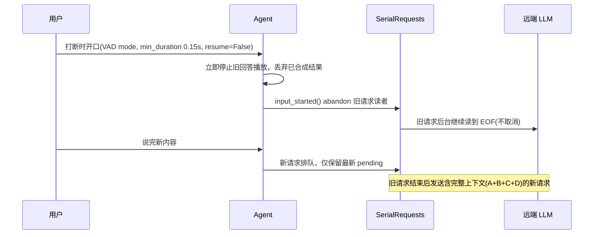
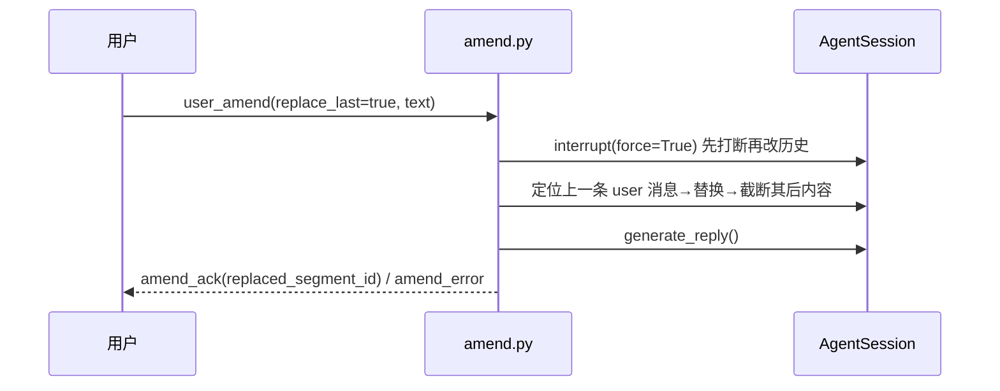
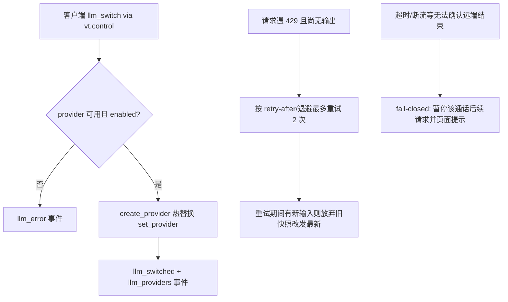

# 核心业务流程

## 1. 语音回合：说话 → 转写 → LLM → 开口

preemptive_generation 关闭，请求只在用户轮次确认后发起（agent/app/main.py、agent/app/tutor_agent.py）。

## 2. 开口打断

打断即停绝不续播；迟到旧字幕不得覆盖定稿（agent/app/llm_gateway/serial.py、README.md）。

## 3. 改错重发（vt.control / vt.events）

先打断后截断的原因：interrupt 会把半截 assistant 回答写回上下文，先截断会以 assistant 结尾被 Anthropic 协议拒绝（agent/app/amend.py）。

## 4. LLM 渠道即时切换与 429 处理

## 5. 中英混合 TTS

flowchart 文字描述：LLM 流式出句 → SentenceTokenizer 按中英标点切句 → 每句 split_language_runs 分段（中文 voice_zh / 英文 voice_en）→ _SYNTH_LOCK 串行 say 合成、WAV 格式校验（单声道/16bit/采样率/长度）→ 按原顺序 50ms 块推流。打断时已开始的合成允许结束但丢弃结果并跳过剩余片段（agent/app/plugins/macos_tts.py、prefetch_tts.py）。

## 6. 按键说话（PTT）

按住：ptt_start → 开麦 + 老师音频静音（零回声）+ stt.begin_hold；松开：ptt_end → stt.end_hold 整段终结，不依赖 VAD 静音判定；迟到临时识别不能串入下一句（server/web-test.html、agent/app/main.py）。

**非核心流程**（文字带过）：语速运行时调节（tts_rate 控制消息，set_rate 影响后续句子）；麦克风选择与虚拟设备过滤（VIRTUAL_MIC_RE）及 4 秒无声警告；token 失效自动重取；acceptance.py 服务生命周期管理（端口归属校验、进程身份/cwd 绑定）。