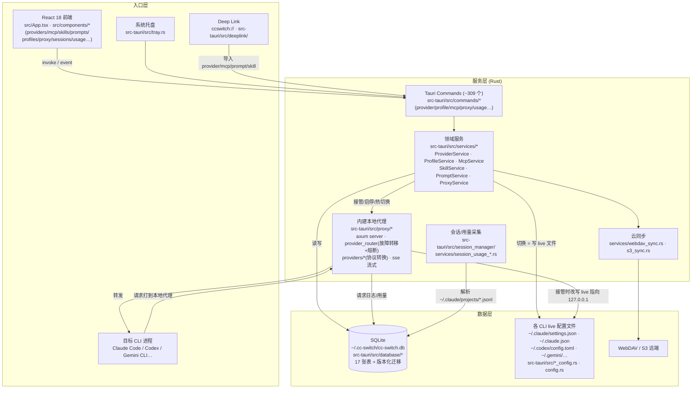

# architecture — cc-switch

**结论**：经典 Tauri 三层架构——React 渲染进程只做 UI 与 IPC，全部业务在 Rust 侧 `commands → services → database/live 文件` 纵向流转；一个独立的 `proxy/` 子系统（内建 axum 服务器）在"接管模式"下劫持各 CLI 的 live 配置，把请求转发到选定的第三方供应商并支持熔断/故障转移。

## 分层导读

**入口层**
- 前端（`src/`）：`main.tsx` bootstrap（数据库版本过新时渲染恢复界面）→ `App.tsx` 单窗口应用；顶部 `AppSwitcher` 在 10 个 AppType（claude / claude-desktop / codex / gemini / grokbuild / opencode / openclaw / hermes / pi / mcode，`app_config.rs:396-412`）间切换，页面级路由是组件内 `currentView` 状态（`src/App.tsx:183`，settings / prompts / skills / mcp / sessions / workspace 等，`App.tsx:1033-1111`）。数据获取统一走 `src/lib/api/*` + TanStack Query。
- 托盘（`tray.rs`）：含项目（Profiles）子菜单，可一键切换 profile。
- Deep link（`deeplink/`）：`ccswitch://v1/import` 导入四类资源。

**服务层**
- `commands/`（35+ 模块）：薄壳，只做参数解析并转调 service。
- `services/`：领域核心。`provider/mod.rs`（7,631 行）是供应商 CRUD 与切换编排；`proxy.rs`（10,769 行）是代理生命周期（start/stop/takeover/hot_switch）；`profile.rs` 是项目快照；另有 MCP/skill/prompt 物化、speedtest、订阅与余额、usage 聚合。
- `proxy/`：独立子系统。`server.rs` 起 axum 监听；`provider_router.rs` 按"当前供应商 / 故障转移队列 + 熔断器（circuit_breaker）"选择上游；`providers/transform_*.rs` 做跨厂商协议转换；`sse.rs` / `streaming_*.rs` 处理流式响应。
- `session_manager/` + `services/session_usage_*.rs`：从各 CLI 本地会话文件（如 `~/.claude/projects/*.jsonl`）增量解析 token 用量，无代理模式下也能统计。

**数据层**
- SQLite 为 SSOT（providers / mcp_servers / skills / prompts / profiles / proxy_config 等 17 张表，`database/schema.rs`），启动时自动从旧 `config.json` 迁移（`lib.rs:536`）。
- "切换供应商"的本质是把数据库里的供应商配置**物化写入**目标 CLI 的 live 配置文件；接管模式下则改为写入本地代理地址并备份原配置（`proxy_live_backup` 表）。
- WebDAV/S3 双通道云同步配置库。

## 关键横切点

- **锁与并发**：供应商切换与接管开关共用 per-app switch lock（`services/provider/mod.rs:5743`）；SQLite 用连接锁（`database::lock_conn`）。
- **崩溃恢复**：`recover_from_crash`（`services/proxy.rs:2677`）+ live 文件中的接管占位符检测，防止代理异常退出后 live 配置悬空。
- **错误与本地化**：`AppError::localized` 中英双语用户可见错误；日志 URL 脱敏（`lib.rs` RedactedUrl）。
