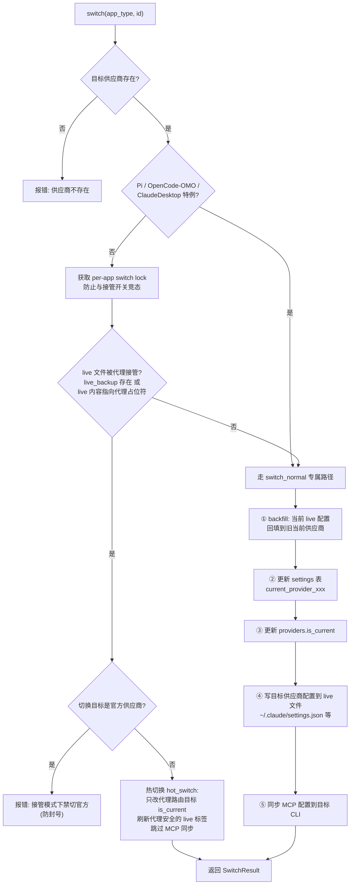
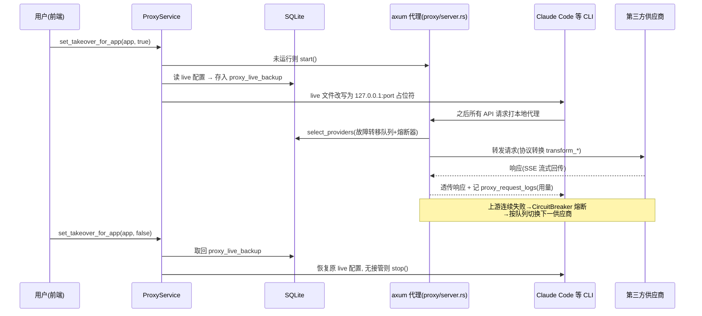
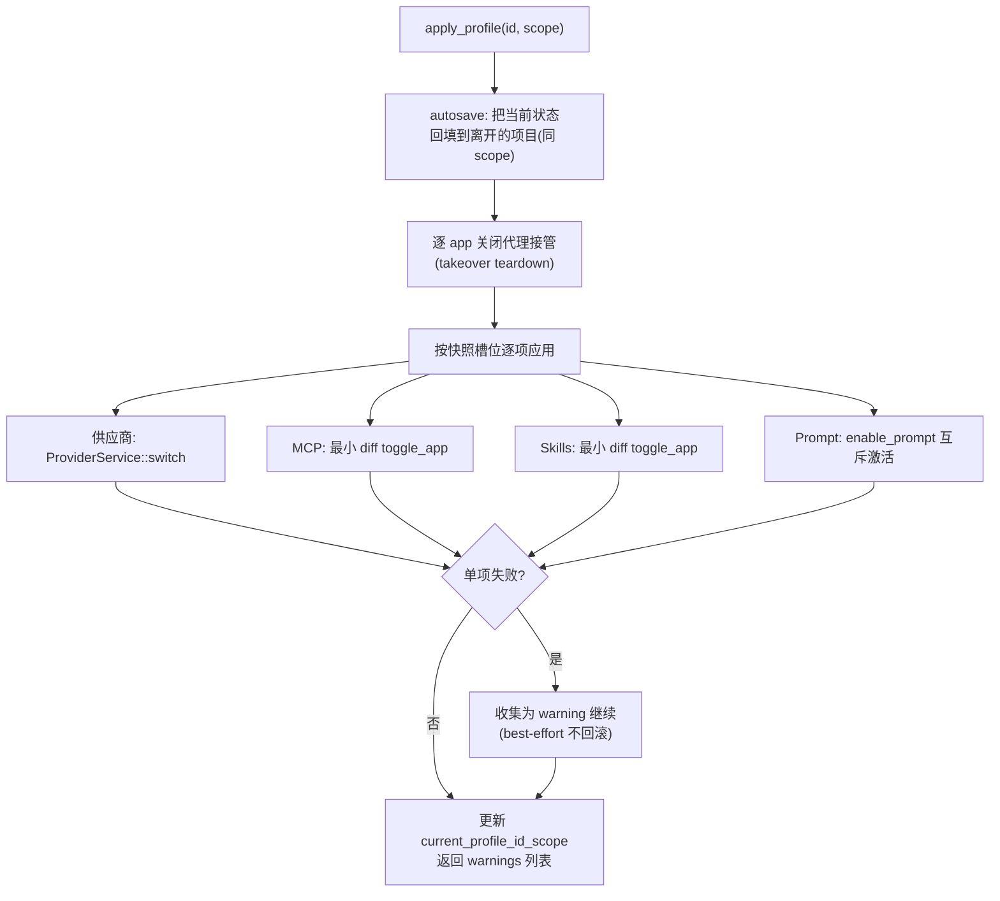
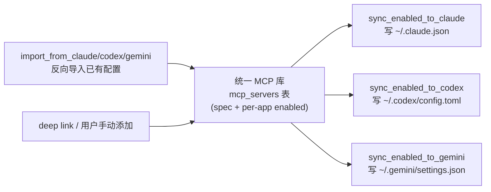
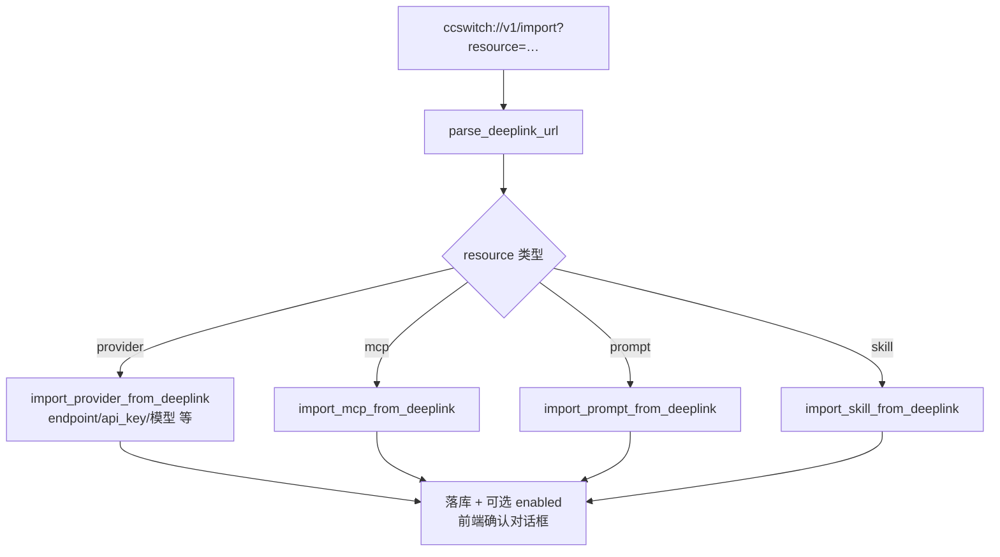

# business-logic — cc-switch

**结论**：cc-switch 的业务核心是"配置搬运工"——把 SQLite 里的供应商/MCP/skill/prompt 配置物化到各 CLI 的 live 文件；第二大业务是内建代理的接管与故障转移；其余为项目快照（Profile）、deep link 导入两大入口流程。以下 5 条为核心流程，其余见文末概述。

## 1. 供应商切换（最核心）

入口：前端 ProviderCard / `useProviderActions` → `commands/provider.rs` → `ProviderService::switch`（`src-tauri/src/services/provider/mod.rs:5712`）。

依据：`services/provider/mod.rs:5700-5802`（switch 注释明确 5 步流程）、`5743-5749`（switch guard）、`5763-5798`（热切换分支与官方禁切）。

## 2. 代理接管（takeover）与故障转移

入口：`ProxyToggle` → `commands/proxy.rs` → `ProxyService::set_takeover_for_app`（`src-tauri/src/services/proxy.rs:1150`）。接管 = 备份 live 配置、改写为指向本地 axum 代理；CLI 的所有请求改由代理转发，可跨供应商故障转移。

依据：`services/proxy.rs:1150-1210`（接管幂等与重建判定）、`proxy/provider_router.rs:44-52`（故障转移队列选择）、`proxy/circuit_breaker.rs`（熔断）、`proxy/server.rs:101-145`（监听与 accept 循环）。

## 3. Profile 项目快照切换

入口：`ProfileSwitcher`（`src/components/profiles/ProfileSwitcher.tsx:90` 手动触发）→ `commands/profile.rs:166` `apply_profile(id, scope)` → `ProfileService::apply`。Profile 是命名的"项目"实体，快照按 app 分槽保存供应商/MCP/skills/prompt 状态。

依据：`services/profile.rs:1-14`（模块头注释描述 apply 原语与 best-effort 语义）、`commands/profile.rs:165-171`。注意：Profile 与文件系统目录**无绑定**，见 tripwires.md。

## 4. MCP 统一管理与物化同步

入口：`UnifiedMcpPanel` → `commands/mcp.rs` → `McpService` / `mcp/mod.rs`。统一库（`mcp_servers` 表）+ 每服务器按应用启用标志，切换供应商或 toggle 时把启用集投影写入各 CLI 的 MCP 配置文件。

依据：`mcp/claude.rs:41-47`（投影写入）、`mcp/claude.rs:51-108`（反向导入，单项失败不中止）、`lib.rs:55-61`（导出的 sync/remove 函数族覆盖 4 个 CLI）。

## 5. Deep link 一键导入

入口：操作系统 `ccswitch://` URL → `deeplink/parser.rs:14` 解析 → 按 resource 类型分发。

依据：`deeplink/mod.rs:1-9`（支持的四种资源）、`deeplink/mod.rs:29-70`（DeepLinkImportRequest 字段）。

## 非核心逻辑（概述）

- **用量统计**：双通道——代理模式的 `proxy_request_logs` 直接记账；无代理模式由 `services/session_usage_*.rs` 增量解析各 CLI 会话 JSONL（`~/.claude/projects/` 等），SHA256 去重后入库，`usage_stats.rs` 聚合成日/月费用（models.dev 定价同步 + `model_pricing` 表）。
- **云同步**：WebDAV / S3 上传下载整个配置库快照，含自动同步触发（profiles 表变更也触发，CHANGELOG #6147）。
- **会话管理器**：`session_manager/` 按供应商注入环境变量在终端拉起各 CLI 会话。
- **杂项**：speedtest（多端点测速）、订阅/余额查询（subscription/balance）、Claude Desktop 路由切换、环境变量冲突检测（env_checker）、自动更新、托盘、开机自启、i18n（zh/en/ja/zh-TW）。
