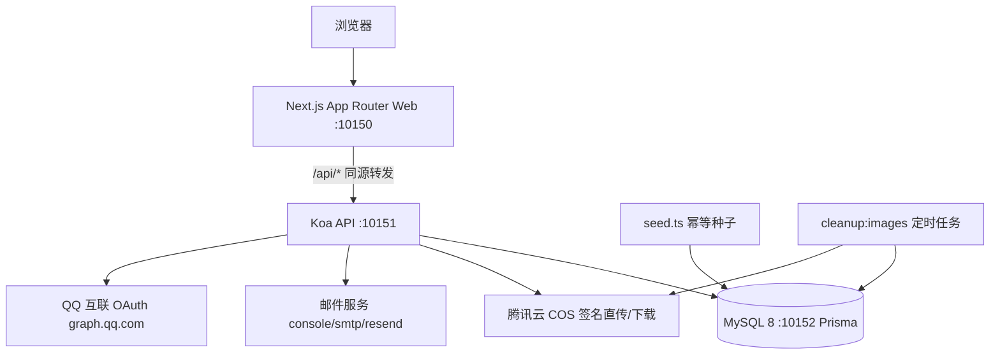

# 架构总览

## 组件职责

- **Next.js Web（app/ + features/）**：承载根路由、登录/注册/改密/身份选择、QQ onboarding、画师工作台、单主视图、管理后台页面及公开排单预览/分享页；`app/layout.tsx` 本地化思源字体并注入元信息。
- **Koa API（backend/src/app.ts）**：单一巨型入口（约 154KB），包含认证（邮箱验证码、密码、QQ OAuth、dev-login）、会话与挑战、RBAC 判定、委托/排单/计时/表单邀请/图片资产等全部业务路由，以及基于 IP 的限流（内存桶）。
- **Prisma + MySQL（backend/prisma/）**：数据模型含 User/Role/Permission/UserRole、ApiEndpoint 权限目录、AuthSession/AuthChallenge/EmailVerificationCode、QqAccount、AuditLog、CommissionOrder、WorkSession、FormInvite、ImageAsset 等；8 个迁移，seed.ts 幂等写入角色、权限、接口目录与可选平台管理员。
- **COS 图片链路（backend/src/lib/cos.ts）**：服务端持有密钥，签发 1 小时上传 URL 与 15 分钟下载 URL；强制 `COS_SITE_PREFIX/COS_ENVIRONMENT/` 命名空间隔离（scopedKey 校验，禁止 `..`、`//`），生产禁止复用 dev 命名空间。
- **会话/密码库（backend/src/lib/session.ts、password.ts）**：Cookie 仅存随机 token，库内存 SHA-256 哈希；会话含 audience（APP/ADMIN）、appMode、sessionVersion 与空闲过期；密码 scrypt-v1。
- **清理脚本（backend/scripts/cleanup-image-assets.ts）**：删除超期未绑定的图片资产，靠外部 cron/PM2 调度。
- **CI/部署（.github/workflows/deploy.yml、docker-compose.*.yml、deploy.sh）**：CI 使用独立 MySQL Service 跑冒烟；生产 MySQL 不暴露公网端口（README 声明，compose 文件实际映射了宿主端口 `${MYSQL_HOST_PORT}`，见 tripwires）。