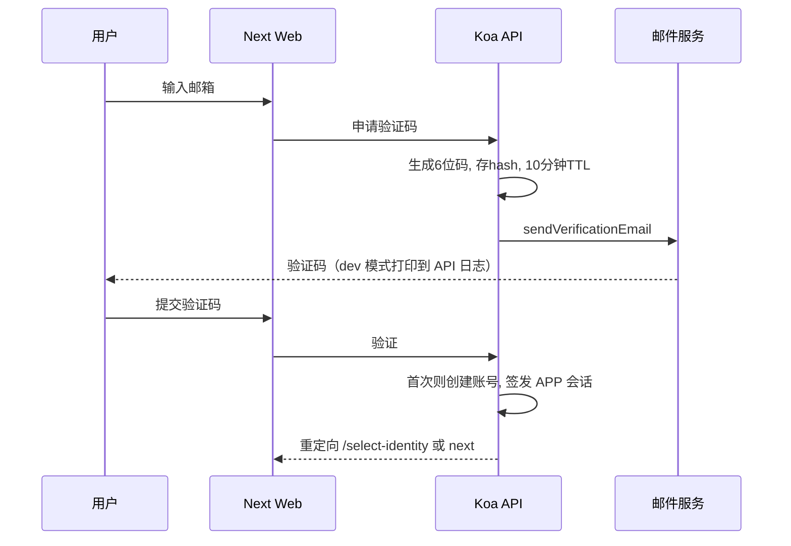
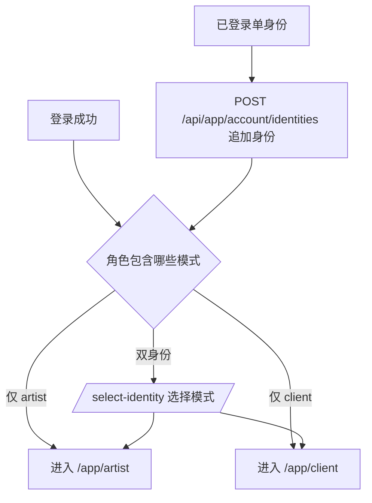
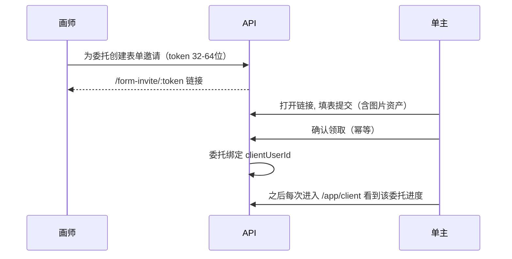
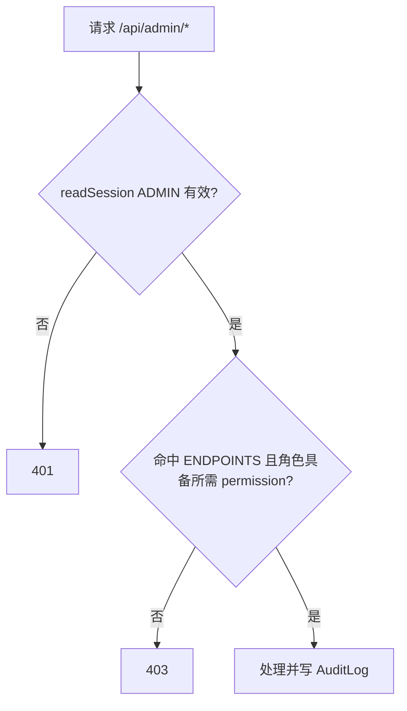

# 核心业务流程

## 1. 邮箱验证码登录/注册

验证码 6 位、10 分钟有效、一次性；首次验证成功即建号并引导选身份（README.md、backend/src/app.ts）。

## 2. 双身份模型与身份选择

角色 ARTIST/CLIENT（scope=APP）决定可用模式；画师注册默认立即获得永久授权；单身份账号可自助追加缺失身份；双身份登录时选择模式，两模式独立路由（README.md、backend/src/constants.ts）。

## 3. 委托邀请绑定（Form Invite）

画师从单笔委托生成专属邀请链接；单主登录/注册后确认领取，之后单主视图只显示明确绑定到当前账号的委托，不做姓名或普通分享链接自动匹配（README.md）。表单邀请支持自定义字段（含 file 类型图片直传 COS）与幂等领取（迁移 form_invite_idempotency）。

## 4. 管理后台 RBAC

管理员经 `/admin/login`（独立 ADMIN 会话 cookie），权限按 `permission.code` 树校验；接口目录（ENDPOINTS）定义 method+pathPattern+protectionType（RBAC/SESSION_ONLY），seed 幂等同步；后台支持用户管理、启停、角色分配（含画师有效期）、自定义角色与权限树、审计日志（backend/src/constants.ts、seed.ts、schema.prisma）。

## 5. 画师工作台排单与计时

委托状态含 pending_review（待审核）等，支持拖拽排序（position，PATCH 不继承 create 默认值避免字段被重置）、审核、稿酬（Decimal 12,2）、绘制计时（WorkSession + ActiveWorkTimer）、公开进度（publicProgress + 公开排单 token 分享）（features/workbench/、app.ts schema、queue-preview 页面）。

## 6. QQ 登录

首次 QQ 登录走 onboarding 选择一个工作台身份，不自动开通双身份；state 经 `gettoit_qq_oauth_state` httpOnly cookie 防护；openid/unionid 落 QqAccount 表（backend/src/lib/qq-oauth.ts、schema.prisma、README.md）。

**非核心流程（文字带过）**：密码修改需 PASSWORD_CHANGE 挑战 cookie；图片资产未绑定残留由 cleanup:images 每 30 分钟清理；公开排单预览页 `queue-preview` 仅供预览不索引。