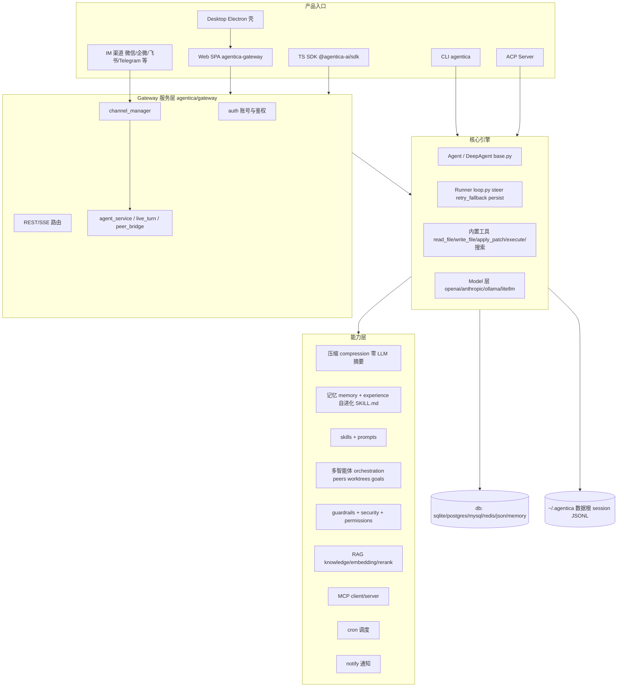

# 架构

结论先行：Agentica 是单体 Python 包内的分层架构——核心 Agent/Runner 引擎在最底层，其上是记忆/压缩/技能/经验等能力层，顶部三个产品入口（CLI、Gateway Web、Desktop）共享同一套引擎与 `~/.agentica` 数据根。



## 组件职责

- **产品入口**：CLI（`agentica/cli/`，交互 TUI、`task`/`delegate`/peer 消息）；Gateway（`agentica/gateway/`，FastAPI 形态的 REST/SSE 服务、多账号、IM 渠道管理，信源 web/README.md + gateway/ 目录）；Desktop（`desktop/`，无业务逻辑的 Electron 壳：单实例、attach-or-spawn gateway、token 换 session cookie、崩溃重启，信源 desktop/README.md）；TS SDK（`sdk-ts/`，纯 HTTP/SSE 客户端）。
- **核心引擎**：`agentica/agent/base.py`（Agent 定义、API 四件套 run/run_stream/run_sync/run_stream_sync）；`agentica/runner/loop.py`（Agentic Loop、并行工具、死循环检测）；`agentica/model/`（多厂商模型适配、流式重试、usage/成本）；内置工具集（文件、execute、web search）。
- **压缩**：`agentica/compression/`——超大工具输出落盘留预览、80% 窗口触发淘汰、满窗空窗换窗 + 交接 notes，全程零 LLM 摘要，原文留 session JSONL 可 `search_session` 回取（信源 README.md）。
- **记忆与自进化**：`agentica/memory/`（会话 JSONL、working memory、长期记忆索引/内容分离）；`agentica/experience/`（经验卡片编译为跨会话复用的 `SKILL.md`）。
- **多智能体**：`agentica/orchestration/`（workflow、swarm、critic、handoff）、`agentica/peers/`（跨终端 peer、worktree、冲突）、goal 循环（`agentica/agent/goals.py`、`run_goal()`）。
- **安全**：`agentica/guardrails/`（输入/输出/工具三级）、`agentica/security/redact.py`、权限档（`agentica/agent/approvals.py`、`permissions.py`）、shell hooks 与出网管控（`agentica/shell_hooks/`）。
- **集成**：MCP（仅 2.x）、ACP server、RAG（knowledge/embedding/rerank）、cron 调度、notify 多渠道通知。
- **持久化**：`agentica/db/` 多后端抽象；会话原文始终写 session JSONL（`agentica/memory/session_log.py`，约 87KB 的核心文件）。

> 注：gateway 具体 Web 框架未在快照中直接确认，标为未核实。
```

```