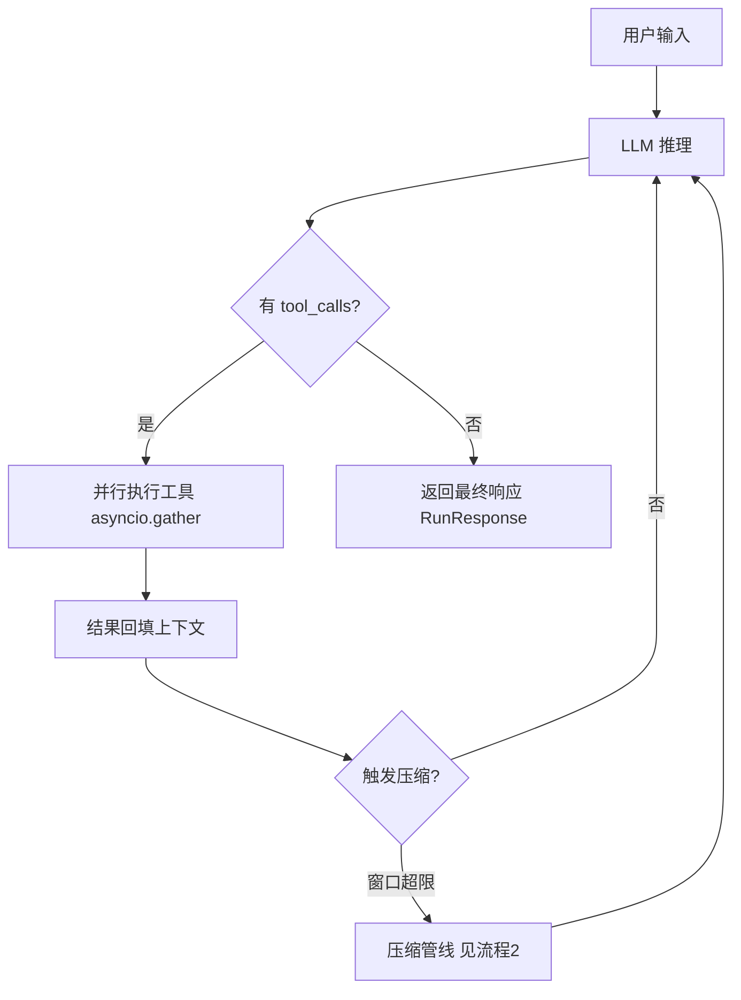
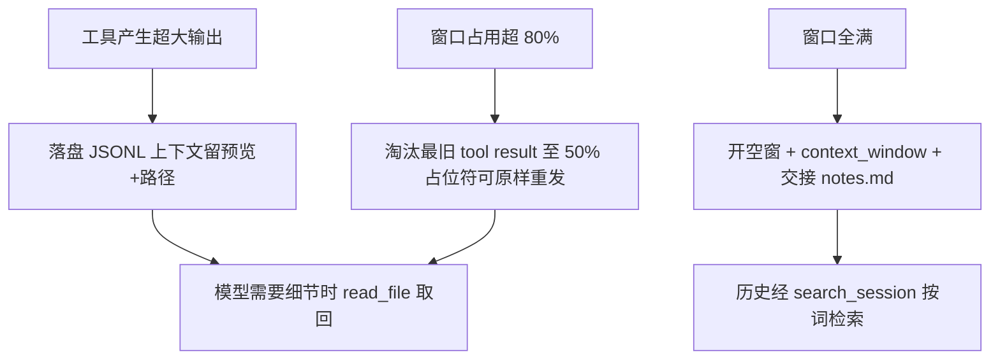
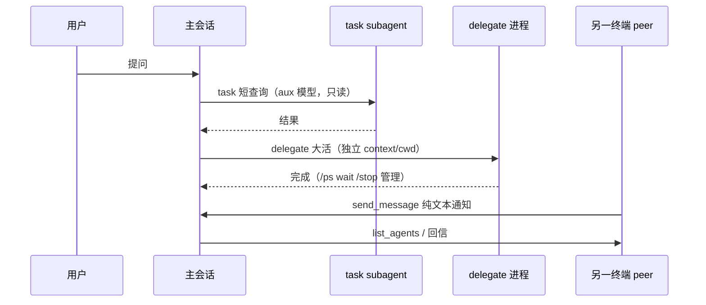
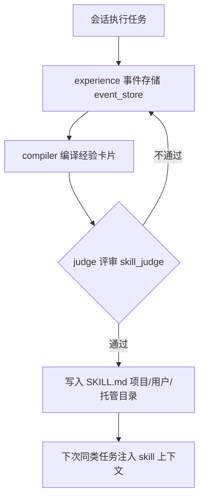
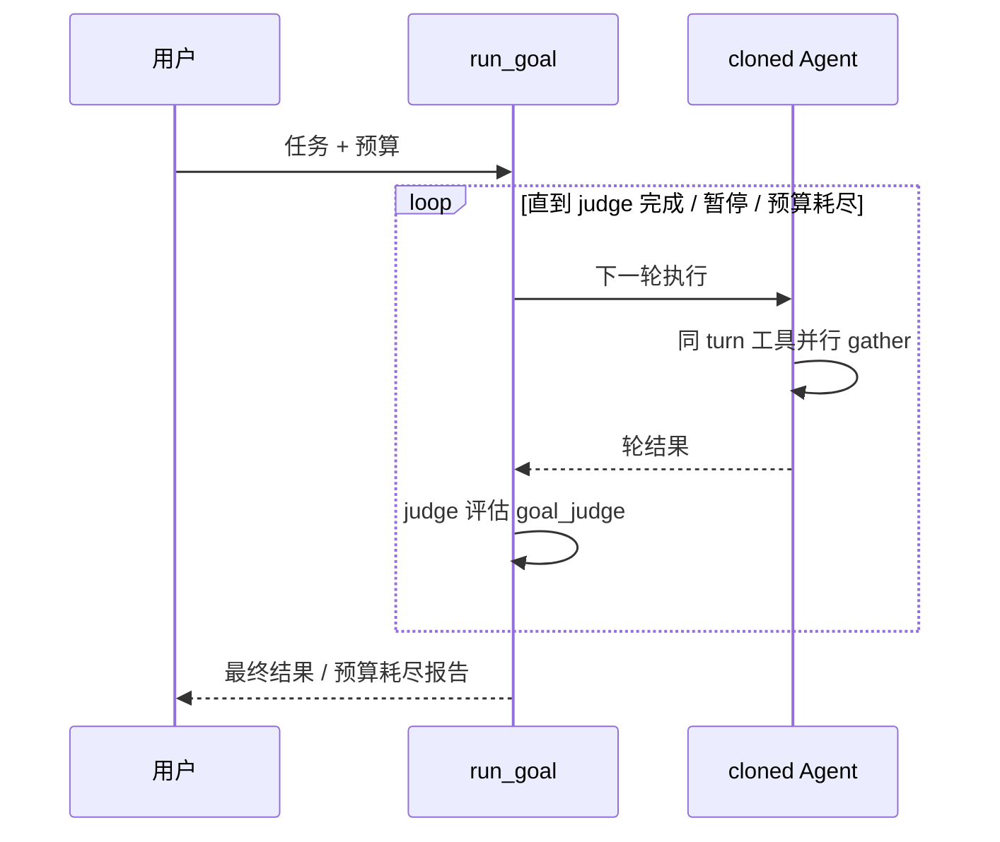

# 核心业务流程

结论先行：Agentica 的核心价值链是「Agentic Loop 驱动 + 零 LLM 摘要压缩保长会话 + 多会话协作 + 经验自进化」，以下 5 条流程覆盖主要逻辑。

## 1. Agentic Loop（主执行循环）

Runner 自动驱动 LLM↔工具多轮循环，多工具调用用 `asyncio.gather()` 并行，含死循环检测、成本预算、API 重试（信源 examples/README.md、agentica/runner/loop.py）。



## 2. 无损上下文压缩（零 LLM 摘要）

三层防线：超大工具输出产生即落盘（留 2000 字预览 + 路径）；窗口占用 >80% 才最旧优先淘汰回 50%；真满窗才开空窗并写交接 notes。原文始终在 session JSONL，可 `search_session` 回取（信源 README.md、agentica/compression/）。



## 3. 多会话协作：task / delegate / peer

三种粒度：进程内只读 subagent（task）、进程级完整 agent 进程（delegate，经 `/ps`/`wait`/`/stop` 托管）、跨终端纯文本 peer 消息（信源 README.md 表格）。



## 4. 自进化：经验编译为 SKILL.md

会话经验自动编译成可跨会话复用的 `SKILL.md`，下次同类任务直接读取上次结论（信源 README.md、agentica/experience/skill_upgrade.py、skills/catalog.py）。



## 5. Goal 长程任务循环（run_goal）

`run_goal()` 驱动 agent 循环直到完成/暂停/预算（turn/token/墙钟）耗尽；内部 `agent.clone()` 隔离并发调用；同 turn 工具调用并行、跨 turn 串行（信源 examples/goal/README.md、agentica/agent/goal_mixin.py）。



## 非核心流程（文字带过）

- **Gateway IM 消息**：IM 渠道（微信/企微/飞书/Telegram 等，`gateway/channels/`）→ channel_manager → agent_service 路由到 `@会话名` 或 gateway agent 统一指挥 → response_formatter 回包。
- **RAG**：knowledge 加载文档 → embedding 向量化 → 混合检索 + rerank → 注入上下文。
- **Guardrails**：输入/输出/工具三级护栏在流式过程中实时检测，可提前终止（examples/guardrails/）。
- **Cron**：`/cron` 命令 + daemon 定时触发 agent 任务（agentica/cron/、cli/commands/cron_cmd.py）。
```

```